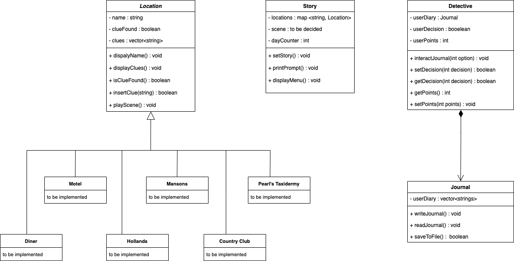

# Murder Mystery RPG
 > Authors: [Rawan Hassabelrasoul](https://github.com/rawanhass), [Angela Han](https://github.com/AngelaHan1), [Adlai Morales-Bravo](https://github.com/AdlaiMB), [Linda Ghunaim](https://github.com/lindgh)

## Project Description
 > Synopsis: In this choose your own adventure story, you'll embark on a mission to unmask the killer that has been terrorizing a town you have just stumbled into. Make decisions that could lead you to victory or death. 

 > Key project points:
 > * We all enjoy horror and coding, so we think it would be interesting to see how we can use our knowledge of coding so far to implement a text-based roleplay game based on a topic we all enjoy.
 > * We plan to implement our project on Virtual Studio Code in the C++ language. We'll utilize CMake.
 > * The user will use their keyboard to provide input when prompted. For example, when prompted to choose a character, the output will tell the use what kind of input it is expected for each character. So if the output tells the user to type 1 to select the character Buffy, the user must input 1 to select that character. We will also validate the user's input to ensure that valid inputs are being provided. Besides giving instructions to the user on how to interact with the program, the output will also be our mode of storytelling through text on the terminal. 
 > * Features our project will provide include an immersive storyline, interactivity with the environment, a journal to read from and write to.
 
 > ## Phase II
## Class Diagram 

 > ### Description:
 > Within our UML diagram we have four major components that will be used to build our game. These components are Story, Detective, Journal, and Location. The Story object is the container for our story. It holds operations for switching scenes of the game. The location class will have gameplay for each scene, and contain clues for the storyline. The Story object will leverage the location class to organize the story. The Detective object represents the user. It will contain functions for user actions, such as interacting with the Journal object and Story object. The Journal object will be used for storing user notes and will have operations to interact with the notes taken down, such as reading and writing. 
 
 > ## Phase III
 > You will need to schedule a check-in for the second scrum meeting with the same reader you had your first scrum meeting with (using Calendly). Your entire team must be present. This meeting will occur on week 8 during lab time.
 > * Before the meeting you should perform a sprint plan like you did in Phase I.
 > * You should also make sure that your README file (and Project board) are up-to-date reflecting the current status of your project and the most recent class diagram. Previous versions of the README file should still be visible through your commit history.
> 
> During the meeting with your reader you will discuss: 
 > * How effective your last sprint was (each member should talk about what they did)
 > * Any tasks that did not get completed last sprint, and how you took them into consideration for this sprint
 > * Any bugs you've identified and created issues for during the sprint. Do you plan on fixing them in the next sprint or are they lower priority?
 > * What tasks you are planning for this next sprint.

 
 > ## Final deliverable
 > All group members will give a demo to the reader during lab time. ou should schedule your demo on Calendly with the same reader who took your second scrum meeting. The reader will check the demo and the project GitHub repository and ask a few questions to all the team members. 
 > Before the demo, you should do the following:
 > * Complete the sections below (i.e. Screenshots, Installation/Usage, Testing)
 > * Plan one more sprint (that you will not necessarily complete before the end of the quarter). Your In-progress and In-testing columns should be empty (you are not doing more work currently) but your TODO column should have a full sprint plan in it as you have done before. This should include any known bugs (there should be some) or new features you would like to add. These should appear as issues/cards on your Project board.
 > * Make sure your README file and Project board are up-to-date reflecting the current status of your project (e.g. any changes that you have made during the project such as changes to your class diagram). Previous versions should still be visible through your commit history. 
 
 ## Screenshots
 > Screenshots of the input/output after running your application
 ## Installation/Usage
 > Instructions on installing and running your application
 ## Testing
 > How was your project tested/validated? If you used CI, you should have a "build passing" badge in this README.
 
